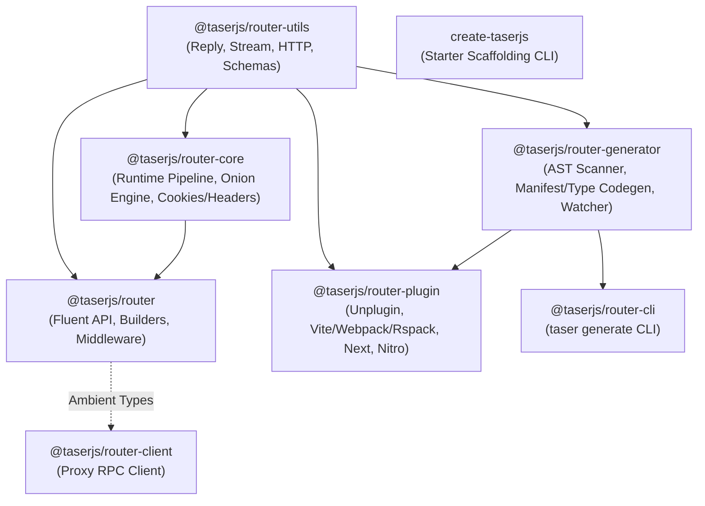

# TaserJS — Architecture & Core Concepts

TaserJS is a high-performance, full-stack, type-safe backend framework for JavaScript and TypeScript. It bridges file-based API routing, functional middleware pipelines, Standard Schema validation, compile-time return contracts, and multi-runtime deployment across Node.js, Bun, Deno, Cloudflare Workers, Vercel, and Next.js.

---

## 1. Core Philosophy & Design Principles

1. **End-to-End Type Safety Without Bloat**:
   Route inputs (query, params, body), layout-derived context/state, and structured response returns (`t.returns({ 200: UserSchema })`) are inferred at compile time into an ambient declaration (`routes.d.ts`), enabling instant RPC client type inference without code bloat.

2. **Decoupled Three-Tier Architecture**:
   - **Definition Tier (`@taserjs/router`)**: Pure, fluent builder API used in application code (`src/taser.ts`, `src/routes/`).
   - **Generation Tier (`@taserjs/router-generator`)**: Fast, AST-based file scanner and code/type generator with zero host or runtime dependencies.
   - **Integration Tier (`@taserjs/router-plugin`)**: Universal bundler plugin (`unplugin`) connecting the generated routing model to build systems (Vite, Webpack, Rspack, Rollup, Rolldown, esbuild), standalone dev servers, Next.js, and Nitro.

3. **Standard Schema First**:
   All runtime validation uses the [Standard Schema Spec](https://github.com/standard-schema/spec) (`@standard-schema/spec`), providing vendor-agnostic schema validation for Zod, Valibot, ArkType, and TypeBox out of the box.

4. **Multi-Runtime Deployment**:
   Taser compiles down to standard Web Fetch API request handlers (`(request: Request) => Promise<Response>`), allowing transparent execution on any modern runtime or server framework (Hono, Express, Fastify, Nitro, Cloudflare Workers, Node.js HTTP).

---

## 2. Package Topology & Roles



### Monorepo Packages:

| Package                         | Purpose & Boundary                                                                                                                                                                                                 |
| :------------------------------ | :----------------------------------------------------------------------------------------------------------------------------------------------------------------------------------------------------------------- |
| **`@taserjs/router-utils`**     | Foundational leaf package: structured HTTP replies (`/reply`), SSE/binary streaming (`/stream`), HTTP verbs/status codes/MIME types (`/http`), path composition (`/mount`), and Standard Schema validation runner. |
| **`@taserjs/router-core`**      | The execution engine: onion middleware dispatch pipeline, cookie and header lifecycles, body decoding, response finalization, and Hono-backed runtime adapter.                                                     |
| **`@taserjs/router`**           | The user-facing fluent router builder API (`createTaserApp`, `t.get`, `t.post`, `t.middleware`, `t.returns`, `t.create(manifest)`).                                                                                |
| **`@taserjs/router-generator`** | Build-time AST code scanner and compiler. Emits `routeManifest`, virtual app entrypoints, ambient `routes.d.ts` type declarations, and automated route file scaffolding.                                           |
| **`@taserjs/router-plugin`**    | Multi-bundler integration layer built on `unplugin`. Provides Vite dev server middleware, standalone production entry shim, Nitro server engine module, and Next.js disk adapter (`withTaser`).                    |
| **`@taserjs/router-client`**    | Lightweight, browser-compatible RPC client (`createClient<AppRoutes>`) consuming generated route types with zero runtime dependencies.                                                                             |
| **`@taserjs/router-cli`**       | Developer CLI (`taser generate`) for manual or build-step route type generation.                                                                                                                                   |
| **`create-taserjs`**            | Interactive project scaffolding CLI for rapid template initialization.                                                                                                                                             |

---

## 3. The Request Lifecycle & Pipeline

### A. Routing & File-System Hierarchy

Routes live under `src/routes/` with verb-suffixed file names:

- `src/routes/index.get.ts` $\rightarrow$ `GET /`
- `src/routes/users/[id].get.ts` $\rightarrow$ `GET /users/:id`
- `src/routes/users/index.post.ts` $\rightarrow$ `POST /users`
- `src/routes/$.ts` $\rightarrow$ Root middleware layout applied to all sibling and child routes.
- `src/routes/admin/$.ts` $\rightarrow$ Nested middleware layout applied only to `/admin/*` routes.

### B. Cascading Context & Onion Middleware

1. **Layout Cascading**: When a request arrives at `/admin/users/123`, the execution engine constructs the middleware chain by walking up the layout tree:
   $$\text{Root Layout (\$.ts)} \longrightarrow \text{Admin Layout (admin/\$.ts)} \longrightarrow \text{Route Handler (admin/users/[id].get.ts)}$$
2. **State Propagation**: Middleware passes state down the chain via `next({ user, org })`. State is strongly typed and inferred across middleware layers.
3. **Short-Circuiting**: Any middleware can intercept and return an early response (e.g. auth guard returning `401 Unauthorized`), halting downstream handlers.

### C. Standard Schema Validation & Coercion

- Query parameters, path parameters, and request bodies are validated against declared Standard Schemas before the route handler is invoked.
- Form data, URL-encoded bodies, and JSON payloads are decoded and validated automatically based on the route definition.

---

## 4. Virtual Module Resolution & Compilation

In Vite and other `unplugin`-supported bundlers, Taser uses zero-disk virtual modules during development:

1. **`#taserjs/virtual/manifest`**: Dynamically synthesized object graph containing all route imports, layouts, and HTTP verb mappings.
2. **`#taserjs/virtual/entry`**: The compiled Taser app instance initializing `t.create(routeManifest)`.
3. **`#taserjs/virtual/app`**: The composed application bridging Taser routes, optional host servers (Hono/Express), and 404 fallbacks.

For frameworks that do not support virtual module graphs (such as Next.js App Router), `@taserjs/router-plugin/next` emits materialized versions of these files directly to `.taser/` on disk and keeps them synced via file watching.

---

## 5. End-to-End Type Flow

```
[ Route Files (*.ts) ]
       │ (AST Scan & Type Extraction)
       ▼
[ .taser/types/routes.d.ts ] ──► (Infers AppRoutes)
       │
       ├─────────────────────────┐
       ▼                         ▼
[ IDE Type Assistance ]    [ @taserjs/router-client ]
(Route Params, Body, Context)  (Proxy RPC Client: client.users({ id }).$get())
```
